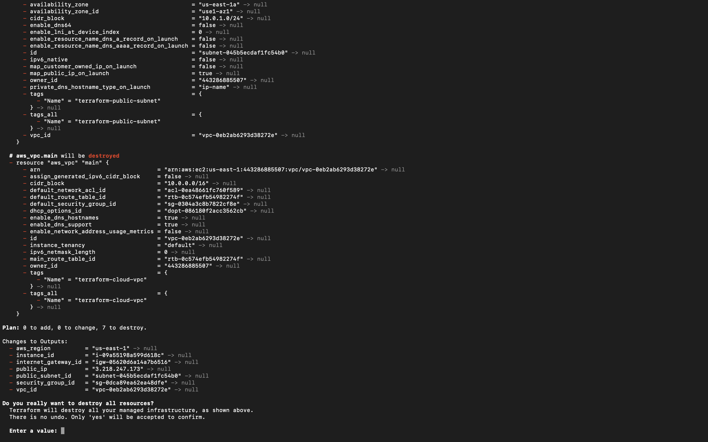
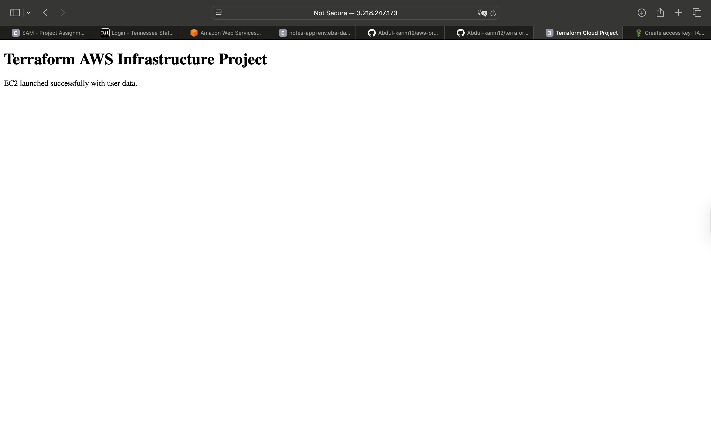

# Terraform AWS Infrastructure Project

Infrastructure deployed on AWS using Terraform.

## What this project creates
- VPC
- Public Subnet
- Internet Gateway
- Route Table
- Security Group
- EC2 Instance

## Tech
- Terraform
- AWS EC2
- AWS VPC
- Infrastructure as Code

## Run

terraform init  
terraform plan  
terraform apply

## Deployment Proof

